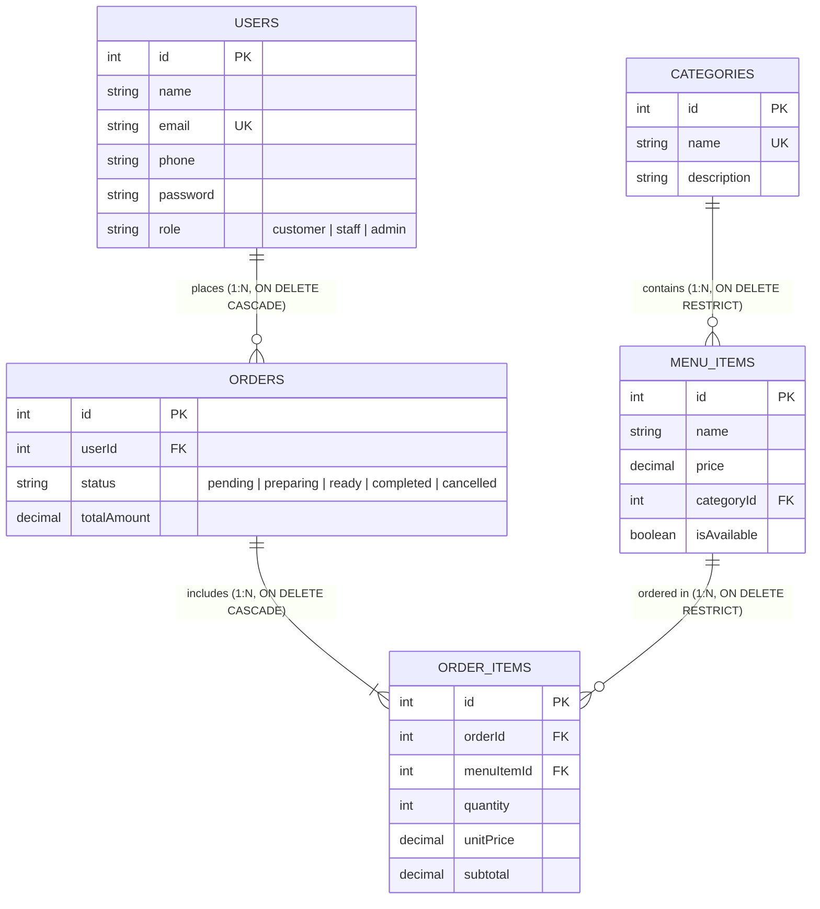

# Savoria Restaurant System — Presentation & Demonstration Script

This presentation script is your complete step-by-step guide for demonstrating the **Savoria Restaurant Management System**. It provides exact speaking talking points, code walkthrough explanations, terminal commands, and live UI demo instructions covering all 10 required presentation topics.

---

## Presentation Agenda & Quick Reference

| # | Topic | What You Will Demonstrate |
|---|---|---|
| **1** | **PostgreSQL Database & Tables** | `users`, `categories`, `menu_items`, `orders`, `order_items` schema & data types |
| **2** | **Table Relationships** | 1:N relations, Foreign Keys, `ON DELETE CASCADE`, `ON DELETE RESTRICT`, ER Diagram |
| **3** | **Express API Architecture** | Layered design: Routes $\to$ Middleware (Zod, JWT) $\to$ Controllers $\to$ Sequelize Models |
| **4** | **API Endpoints & Access Control** | Public vs. Customer vs. Staff vs. Admin Role-Based Access Control (RBAC) |
| **5** | **Frontend Architecture** | Next.js 16 App Router, Tailwind CSS, `AuthContext`, `CartContext`, modular UI components |
| **6** | **Creating & Viewing Menu Items** | Live demo: Staff adds category and dish on `/staff/menu`, reflected immediately on `/` |
| **7** | **Creating an Order** | Live demo: Cart checkout, atomic database transactions (`sequelize.transaction()`) |
| **8** | **Viewing Orders & Items** | Live demo: Itemized digital receipt, staff read-only tracking, customer order cancellation |
| **9** | **Frontend-to-Backend Communication**| Axios instance, Bearer token interceptor, 401 automatic logout handling, CORS |
| **10**| **End-to-End Data Flow** | Full lifecycle: PostgreSQL $\to$ Sequelize $\to$ Express $\to$ Axios $\to$ React $\to$ UI Render |

---

## 1. PostgreSQL Database and Tables

### Speaking Script
> *"To start, I'll walk through our database layer. We chose PostgreSQL for our database because restaurant operations demand strict ACID compliance, transactional integrity, and relational guarantees. For instance, when a customer places an order with multiple food items, our financial totals and line-item records must never enter an inconsistent state."*

### What to Show in Terminal / `psql`

Open your terminal or database client (`psql -U postgres -d restaurant_db` or via your GUI like pgAdmin/DBeaver):

```sql
-- 1. Display all tables in the database
\dt

-- 2. Inspect the structure and constraints of each table
\d users
\d categories
\d menu_items
\d orders
\d order_items
```

### Table Breakdown Explanation

1. **`users` Table:**
   - **Columns:** `id` (PK, auto-increment), `name` (VARCHAR), `email` (VARCHAR, UNIQUE), `phone` (VARCHAR), `password` (VARCHAR, bcrypt hash), `role` (VARCHAR, default `'customer'`).
   - **Key Detail:** Passwords are never stored in plaintext. They are hashed with `bcrypt` (10 salt rounds), and the `Users.prototype.toJSON()` method in Sequelize automatically strips the password field from any API response.
2. **`categories` Table:**
   - **Columns:** `id` (PK), `name` (VARCHAR, UNIQUE), `description` (TEXT).
   - **Key Detail:** Groups dishes logically (e.g., Burgers, Pizzas, Beverages).
3. **`menu_items` Table:**
   - **Columns:** `id` (PK), `name` (VARCHAR), `description` (TEXT), `price` (DECIMAL(10,2)), `categoryId` (FK $\to$ `categories.id`), `isAvailable` (BOOLEAN, default `true`).
   - **Key Detail:** The `isAvailable` flag lets the kitchen mark a dish as Sold Out without deleting historical menu data.
4. **`orders` Table:**
   - **Columns:** `id` (PK), `userId` (FK $\to$ `users.id`), `status` (VARCHAR, default `'pending'`), `totalAmount` (DECIMAL(10,2)).
   - **Status Lifecycle:** `pending` $\to$ `preparing` $\to$ `ready` $\to$ `completed` (or `cancelled`).
5. **`order_items` Table (Junction / Line Items):**
   - **Columns:** `id` (PK), `orderId` (FK $\to$ `orders.id`), `menuItemId` (FK $\to$ `menu_items.id`), `quantity` (INTEGER), `unitPrice` (DECIMAL(10,2)), `subtotal` (DECIMAL(10,2)).
   - **Key Detail:** Stores `unitPrice` at the exact time of order placement so historical receipts remain accurate even if food prices change later.

---

## 2. Table Relationships & Constraints

### Speaking Script
> *"Our database uses strict relational modeling with explicit foreign key constraints to prevent orphaned records and protect financial history. Here is the architectural entity-relationship diagram."*

### Entity-Relationship Diagram



### Key Relational Rules to Highlight

1. **`USERS` $\to$ `ORDERS` (1-to-Many, `ON DELETE CASCADE`):**
   - If a customer deletes their user profile, their associated orders are cleaned up via cascading deletion (or archived).
2. **`ORDERS` $\to$ `ORDER_ITEMS` (1-to-Many, `ON DELETE CASCADE`):**
   - An order consists of 1 or more line items. If an order is deleted or cancelled, all its order items are removed automatically.
3. **`CATEGORIES` $\to$ `MENU_ITEMS` (1-to-Many, `ON DELETE RESTRICT`):**
   - A category cannot be deleted if there are still menu items linked to it. PostgreSQL rejects the delete with a foreign key violation (HTTP 409 Conflict).
4. **`MENU_ITEMS` $\to$ `ORDER_ITEMS` (1-to-Many, `ON DELETE RESTRICT`):**
   - A menu item that has already been purchased in past orders cannot be dropped from the database, preserving past audit logs and sales receipts.

---

## 3. Express API Architecture

### Speaking Script
> *"Our backend is organized using a clean, layered MVC-style architecture. Each layer has a single responsibility, making the code testable, modular, and maintainable."*

### Directory Organization

```text
backend/src/
├── app.js               # Express application initialization & middleware stack
├── server.js            # HTTP server startup & graceful shutdown
├── routes/              # Route definitions & HTTP verb bindings
│   ├── auth.route.js
│   ├── user.route.js
│   ├── category.route.js
│   ├── menuItem.route.js
│   └── order.route.js
├── middleware/          # Cross-cutting concerns
│   ├── authentication.js# JWT verification & req.user attachment
│   ├── authorization.js # Role permission checking (RBAC)
│   ├── validate.js      # Zod schema validation middleware
│   ├── rateLimiter.js   # DDoS & brute-force throttling
│   └── error.js         # Global centralized error handler
├── controllers/         # Business logic and database coordination
│   ├── authController.js
│   ├── userController.js
│   ├── categoryController.js
│   ├── menuItemController.js
│   └── orderController.js
├── validators/          # Zod validation schemas
│   ├── auth.js, user.js, category.js, menuItem.js, order.js, common.js
└── models/              # Sequelize model classes & associations
```

### Code Flow of a Request
1. Request arrives at `app.js` $\to$ passes CORS and JSON body parser.
2. Matches route in `routes/` (e.g., `POST /api/orders`).
3. Runs `authenticate` middleware $\to$ decodes JWT Bearer token and verifies user exists.
4. Runs `validate(createOrderSchema)` $\to$ Zod parses request body; returns structured 400 Bad Request if fields are invalid.
5. Invokes controller function (e.g., `addOrder`) $\to$ opens database transaction.
6. Queries Sequelize models (`Menu_items`, `Orders`, `Order_items`).
7. Returns standardized JSON response `{ success: true, order: {...} }`.
8. Unhandled exceptions are caught and passed to `middleware/error.js`.

---

## 4. API Endpoints & Role-Based Access Control (RBAC)

### Speaking Script
> *"Security in Savoria is enforced at the route level using Role-Based Access Control (RBAC). We have three user roles: Customer, Staff, and Administrator. Let's look at the endpoint permissions."*

### RBAC Matrix

| Endpoint | HTTP Method | Public | Customer | Staff | Admin | Purpose |
| :--- | :---: | :---: | :---: | :---: | :---: | :--- |
| **`/api/auth/register`** | `POST` |  |  |  |  | Register customer or staff account |
| **`/api/auth/login`** | `POST` |  |  |  |  | Obtain signed JWT access token |
| **`/api/auth/me`** | `GET` | ❌ |  |  |  | Fetch authenticated user details |
| **`/api/users/:id`** | `GET` | ❌ | *(Own profile only)* |  |  | View profile details |
| **`/api/users/:id`** | `PUT` | ❌ | *(Own profile only)* | *(Own profile)* |  | Update personal information |
| **`/api/users/:id`** | `DELETE`| ❌ | *(Own profile only)* | ❌ |  | Delete own customer account |
| **`/api/categories`** | `GET` |  |  |  |  | Browse all food categories |
| **`/api/categories/:id`** | `GET` |  |  |  |  | View single category details |
| **`/api/categories`** | `POST` | ❌ | ❌ |  |  | Create category |
| **`/api/categories/:id`** | `PUT` | ❌ | ❌ |  |  | Edit category |
| **`/api/categories/:id`** | `DELETE`| ❌ | ❌ |  |  | Delete category |
| **`/api/menu-items`** | `GET` |  |  |  |  | View all dishes (filter by `?categoryId=`) |
| **`/api/menu-items/:id`** | `GET` |  |  |  |  | View single dish details |
| **`/api/menu-items`** | `POST` | ❌ | ❌ |  |  | Add new menu dish |
| **`/api/menu-items/:id`** | `PUT` | ❌ | ❌ |  |  | Update dish price/description/availability |
| **`/api/menu-items/:id`** | `DELETE`| ❌ | ❌ |  |  | Delete dish |
| **`/api/orders`** | `GET` | ❌ | *(Own orders only)* | *(All orders)* | *(All orders)* | Track orders (Staff tracking) |
| **`/api/orders/:id`** | `GET` | ❌ | *(Own order only)* |  |  | View order details & itemized receipt |
| **`/api/orders`** | `POST` | ❌ |  | ❌ |  | Place a new order |
| **`/api/orders/:id`** | `PUT` | ❌ | ❌ | ❌ |  | Update order status *(Admin only)* |
| **`/api/orders/:id`** | `DELETE`| ❌ | *(Pending only)* | ❌ |  | Cancel order *(Staff cannot cancel/delete)* |

---

## 5. Frontend Architecture (Next.js 16)

### Speaking Script
> *"Our frontend is built using Next.js 16 with the App Router and Tailwind CSS. It communicates with the backend via Axios, manages user sessions with React Context, and provides responsive mobile and desktop dining experiences."*

### Key Frontend Components & Pages

1. **Pages (`frontend/src/app/`):**
   - **`/` (Menu Catalog):** Real-time search bar, category pill filter, dish cards, and hero banner.
   - **`/login` (Auth Portal):** Unified Sign In and Registration with Customer vs. Staff role selection.
   - **`/profile` (Customer Profile):** View personal information, edit name/phone/email/password, and permanent account deletion danger zone.
   - **`/staff/menu` (Staff Controls):** Dedicated staff dashboard with tabbed management for Categories and Menu Dishes (Create, Edit, Delete).
   - **`/orders` & `/orders/[id]` (Order Tracking):** Customer order tracking, itemized receipt breakdown, and staff read-only order monitoring.
2. **Context Providers (`frontend/src/context/`):**
   - **`AuthContext.jsx`:** Holds `user`, `token`, `isAuthenticated`, `isStaffOrAdmin`. Syncs with `localStorage` (`restaurant_token` and `restaurant_user`) and validates token on startup via `GET /api/auth/me`.
   - **`CartContext.jsx`:** Stores cart items, quantities, subtotal calculations, and powers the slide-over cart drawer.

---

## 6. Live Demo: Creating and Viewing Menu Items

### Step-by-Step Demonstration

#### A. In the Frontend UI
1. **Log in as Staff:**
   - Navigate to `http://localhost:3000/login`.
   - Sign in using:
     - **Email:** `staff@restaurant.com`
     - **Password:** `Staff@123`
   - Notice the role badge displays **"Staff Member"**.
2. **Go to Kitchen Controls:**
   - In the Navbar, click **"Manage Menu"** (navigates to `/staff/menu`).
3. **Create a Category:**
   - Click **"+ Add New Category"**.
   - **Name:** `Chef Specials`
   - **Description:** `Exclusive culinary creations made fresh daily.`
   - Click **"Create Category"** $\to$ Notice the success banner and the new category card appear with `0 dishes`.
4. **Create a Menu Dish:**
   - Switch to the **"Menu Dishes"** tab.
   - Click **"+ Add New Dish"**.
   - **Dish Name:** `Smoked Wagyu Ribeye`
   - **Category:** Select `Chef Specials`
   - **Price:** `34.50`
   - **Description:** `Prime Wagyu ribeye seared with rosemary butter and garlic chips.`
   - Ensure the checkbox **"Available in kitchen line"** is checked.
   - Click **"Create Dish"**.
5. **View on Public Menu:**
   - Click **"Back to Public Menu"** or navigate to `http://localhost:3000`.
   - Notice the new category tab **"Chef Specials"** appears dynamically.
   - Click the tab $\to$ see **"Smoked Wagyu Ribeye"** displayed with its price `$34.50`.

#### B. Terminal / cURL Command (Optional CLI Proof)
```bash
# Obtain Staff JWT token:
TOKEN=$(curl -s -X POST http://localhost:5000/api/auth/login \
  -H "Content-Type: application/json" \
  -d '{"email":"staff@restaurant.com","password":"Staff@123"}' | grep -o '"token":"[^"]*' | cut -d'"' -f4)

# Create category via API:
curl -X POST http://localhost:5000/api/categories \
  -H "Content-Type: application/json" \
  -H "Authorization: Bearer $TOKEN" \
  -d '{"name":"Gourmet Desserts","description":"Handcrafted sweets"}'
```

---

## 7. Live Demo: Creating an Order

### Speaking Script
> *"Now I will demonstrate order creation. In the restaurant industry, high concurrency can lead to overselling or partial orders if an item suddenly goes out of stock. To solve this, our backend wraps every order placement inside an atomic SQL transaction."*

### Step-by-Step Demonstration

1. **Log in as Customer:**
   - Sign in as `customer@restaurant.com` (password: `Customer@123`) or register a new customer account.
2. **Add Dishes to Cart:**
   - From the home menu (`/`), click **"Add"** on a Burger ($12.50) and a Pizza ($18.00).
   - In the top-right Navbar, notice the Cart badge updates to `2`.
3. **Open Cart Drawer & Checkout:**
   - Click the **"Cart"** button in the Navbar $\to$ the slide-over drawer animates open.
   - Adjust quantities using the `+` and `-` buttons. Notice the live subtotal calculation.
   - Click **"Place Order Now"**.
   - The cart clears, and the customer is redirected to `/orders` showing the newly placed order in **"Pending"** status.

### Code Highlight: Database Transaction
Show `backend/src/controllers/orderController.js` lines 150–215:

```javascript
const t = await sequelize.transaction();
try {
  // 1. Verify user exists
  // 2. Loop through each item, verify menuItem exists and isAvailable
  // 3. Compute price and subtotal
  // 4. Create Order record in transaction
  const newOrder = await Orders.create({ userId, status: 'pending', totalAmount }, { transaction: t });
  // 5. Bulk create order items in transaction
  await Order_items.bulkCreate(itemsToCreate, { transaction: t });
  // 6. Commit transaction atomically
  await t.commit();
} catch (error) {
  // If anything fails, rollback completely
  await t.rollback();
  next(error);
}
```

---

## 8. Live Demo: Viewing an Order & Items

### Speaking Script
> *"Let's examine how orders and receipts are viewed and tracked by both the customer and the kitchen staff."*

### Step-by-Step Demonstration

1. **Customer View (`/orders` & `/orders/:id`):**
   - On `/orders`, click **"View Receipt"** on the newly created order.
   - An itemized modal dialog appears showing:
     - Order ID and placement timestamp.
     - Color-coded status badge (`Pending`).
     - Line items with quantity, unit price, and subtotal.
     - Final total amount.
   - Click **"Full Details"** $\to$ navigates to `/orders/[id]` for the standalone receipt view.
2. **Order Cancellation:**
   - While logged in as the customer, notice the red **"Cancel Order"** button is visible because the order is still `pending`.
   - Click **"Cancel Order"** and confirm $\to$ the order is deleted/cancelled, and disappears from active orders.
   - *Security Note:* If the order status were `preparing` or `ready`, the cancel button is hidden, and the backend rejects cancellation with `400 Bad Request`.
3. **Staff View (Read-Only Order Tracking):**
   - Log out and log in as `staff@restaurant.com`.
   - Click **"Order Tracking"** in the Navbar.
   - Notice the heading says **"Kitchen & Order Management"**.
   - Staff can see all customer orders across the entire restaurant.
   - **Crucial Rule:** Notice that staff members have **no delete button and no status dropdown**—staff tracking is strictly read-only per project requirements.

---

## 9. How the Frontend Communicates with the Backend

### Speaking Script
> *"Our frontend communicates with the Express backend using a centralized Axios client configured in `frontend/src/lib/api.js`. It features automatic Bearer token injection and centralized error handling."*

### Key Implementation Details in `lib/api.js`

1. **Base Configuration:**
   ```javascript
   const api = axios.create({
     baseURL: process.env.NEXT_PUBLIC_API_URL || "http://localhost:5000/api",
     headers: { "Content-Type": "application/json" },
     timeout: 10000,
   });
   ```
2. **Request Interceptor (Automatic Authentication):**
   ```javascript
   api.interceptors.request.use((config) => {
     if (typeof window !== "undefined") {
       const token = localStorage.getItem("restaurant_token");
       if (token) {
         config.headers.Authorization = `Bearer ${token}`;
       }
     }
     return config;
   });
   ```
3. **Response Interceptor (Token Expiration & 401 Handling):**
   ```javascript
   api.interceptors.response.use(
     (response) => response,
     (error) => {
       if (error.response?.status === 401 && typeof window !== "undefined") {
         localStorage.removeItem("restaurant_token");
         localStorage.removeItem("restaurant_user");
         window.dispatchEvent(new Event("auth:unauthorized"));
       }
       return Promise.reject(new Error(error.response?.data?.message || "An error occurred"));
     }
   );
   ```

---

## 10. Complete End-to-End Data Flow

### Speaking Script
> *"To conclude our demonstration, let's trace the full lifecycle of data from the PostgreSQL database, through the API, to the frontend user interface."*

### Data Flow Diagram

```mermaid
sequenceDiagram
    autonumber
    actor Customer as User / Browser
    participant React as Next.js React UI
    participant Axios as Axios API Client
    participant Express as Express.js Router & Middleware
    participant Controller as Order Controller
    participant Sequelize as Sequelize ORM
    participant Postgres as PostgreSQL Database

    Note over Customer,Postgres: 1. Customer Places an Order
    Customer->>React: Clicks "Place Order Now" in CartDrawer
    React->>Axios: ordersAPI.create({ items })
    Axios->>Axios: Interceptor attaches Bearer JWT
    Axios->>Express: POST /api/orders (HTTP + Headers)
    Express->>Express: authenticate (Verify JWT & check role)
    Express->>Express: validate(createOrderSchema with Zod)
    Express->>Controller: addOrder(req, res, next)
    Controller->>Sequelize: sequelize.transaction()
    Sequelize->>Postgres: BEGIN TRANSACTION;
    Controller->>Sequelize: Menu_items.findByPk() & availability check
    Sequelize->>Postgres: SELECT * FROM menu_items WHERE id IN (...);
    Postgres-->>Sequelize: Returns item prices & stock
    Controller->>Sequelize: Orders.create(...) & Order_items.bulkCreate(...)
    Sequelize->>Postgres: INSERT INTO orders ...; INSERT INTO order_items ...;
    Postgres-->>Sequelize: Records created
    Sequelize->>Postgres: COMMIT;
    Controller->>Express: Return JSON { success: true, order: {...} }
    Express-->>Axios: HTTP 201 Created (JSON Response)
    Axios-->>React: Promise resolved with populated order object
    React->>React: Update CartContext (clear items) & route to /orders
    React-->>Customer: UI displays Order Confirmation & Status Badge
```

---

## Presentation Q&A Preparation

### 1. "How do you protect passwords in the database?"
> **Answer:** *"We use bcrypt hashing with 10 salt rounds before persisting user records. Furthermore, we customized Sequelize's `toJSON()` prototype on the `Users` model to automatically delete the `password` property from serialized objects, and our controllers explicitly exclude password attributes from SQL queries."*

### 2. "Why use `sequelize.transaction()` when placing orders?"
> **Answer:** *"Because an order involves writing to two tables: `orders` and `order_items`. If the database crashes or an item is unavailable halfway through the operation, a transaction guarantees an automatic rollback, preventing orphan records or incorrect billing."*

### 3. "How did you implement the requirement that staff cannot update or delete orders?"
> **Answer:** *"On the backend, our `updateOrder` and `deleteOrder` controllers explicitly check `if (req.user.role === 'staff') throw new AppError(..., 403)`. On the frontend, we removed the status updater dropdown and delete buttons from staff views, ensuring staff can only track orders in read-only mode."*

### 4. "How do you prevent SQL injection?"
> **Answer:** *"Sequelize uses parameterized prepared statements under the hood for all queries. In addition, every incoming payload is validated against strict Zod schemas before reaching the database query."*

---

*End of Presentation Script. You are ready to present!*
